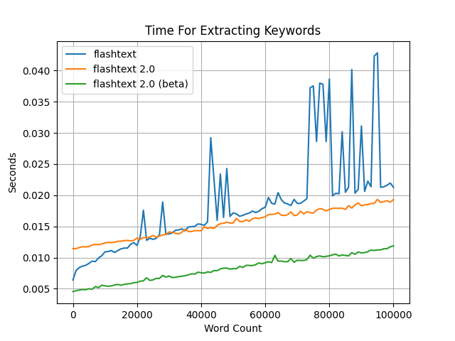
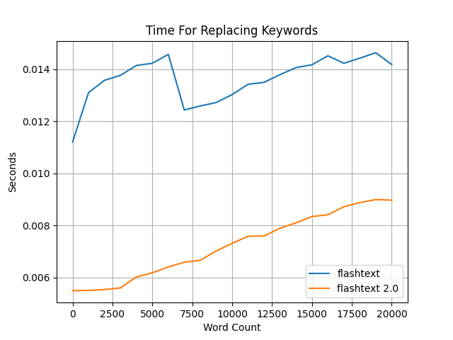

# FlashText 2.0

----
[`flashtext`](https://github.com/vi3k6i5/flashtext)
is great, but wouldn't it be nice if the code was much simpler, so instead of 
[this](https://github.com/vi3k6i5/flashtext/blob/5591859aabe3da37499a20d0d0d6dd77e480ed8d/flashtext/keyword.py#L470-L558):
```py
    def extract_keywords(self, sentence, span_info=False):
        keywords_extracted = []
        if not sentence:
            # if sentence is empty or none just return empty list
            return keywords_extracted
        if not self.case_sensitive:
            sentence = sentence.lower()
        current_dict = self.keyword_trie_dict
        sequence_start_pos = 0
        sequence_end_pos = 0
        reset_current_dict = False
        idx = 0
        sentence_len = len(sentence)
        while idx < sentence_len:
            char = sentence[idx]
            # when we reach a character that might denote word end
            if char not in self.non_word_boundaries:

                # if end is present in current_dict
                if self._keyword in current_dict or char in current_dict:
                    # update longest sequence found
                    sequence_found = None
                    longest_sequence_found = None
                    is_longer_seq_found = False
                    if self._keyword in current_dict:
                        sequence_found = current_dict[self._keyword]
                        longest_sequence_found = current_dict[self._keyword]
                        sequence_end_pos = idx
                        
    # and many more lines ... (89 lines in total)
```
We would get [this](https://github.com/shner-elmo/FlashText2.0/blob/master/flashtext2/keyword_processor.py#L54#L81):
```py
    def extract_keywords_iter(self, sentence: str) -> Iterator[tuple[str, int, int]]:
        if not self._case_sensitive:
            sentence = sentence.lower()
    
        keyword_key = self.keyword
        trie_dict = self.trie_dict
        non_word_boundaries = self.non_word_boundaries
        sentence_len = len(sentence)
        prev_char: str | None = None
    
        for idx, char in enumerate(sentence):
            # if prev_char not in [A-Za-z0-9_] AND the next char is in [A-Za-z0-9_]
            if prev_char not in non_word_boundaries and char in non_word_boundaries:
                longest_kw_tup: tuple[str, int, int] | None = None  # (keyword, start_pos, end_pos)
    
                node = trie_dict
                for i in range(idx, sentence_len):
                    node = node.get(sentence[i])
    
                    if node is None:
                        break
                    kw = node.get(keyword_key)
                    # if kw AND (it's the last char in the sentence OR the next char is not in [A-Za-z0-9_])
                    if kw and (i == sentence_len - 1 or sentence[i + 1] not in non_word_boundaries):
                        longest_kw_tup = (kw, idx, i + 1)  # the last keyword will automatically be the longest
    
                if longest_kw_tup:
                    yield longest_kw_tup
            prev_char = char
```
Much more readable, right?  
Also, other than rewriting all the functions with simpler and more intuitive code,
all the methods and functions are fully typed.

## Performance

Simplicity is great, but how is the performance?

I created some benchmarks which you could find [here](https://github.com/shner-elmo/FlashText2.0/tree/master/benchmarks), 
and it turns out that for extracting keywords it is a bit slower than the original package:



But for replacing keywords, it is much faster! 




---
## Quick Start
Import and initialize the class:
```py
>>> from flashtext2 import KeywordProcessor
>>> kp = KeywordProcessor()
```

Add a bunch of words:
```py
>>> kp.add_keywords_from_dict({'py': 'Python', 'go': 'Golang', 'hello': 'hey'})
```
The dictionary keys represent the words that we want to search in the string, 
and the values are their corresponding 'clean word'.

Check how many words we added:
```py
>>> len(kp)
3
```

We can see how the key/values are stored in the trie dict:
```python
>>> kp.trie_dict
import doctest
{'p': {'y': {'__keyword__': 'Python'}},
 'g': {'o': {'__keyword__': 'Golang'}},
 'h': {'e': {'l': {'l': {'o': {'__keyword__': 'hey'}}}}}}
```


### Extract Keywords

```py
from flashtext2 import KeywordProcessor
kp = KeywordProcessor()
kp.add_keywords_from_dict({'py': 'Python', 'go': 'Golang', 'hello': 'Hey'})

my_str = 'Hello, I love learning Py, aka: Python, and I plan to learn about Go as well.'

kp.extract_keywords(my_str)
```
```
['Hey', 'Python', 'Golang']
```


### Replace Keywords


```py
kp.replace_keywords(my_str)
```
```
'Hey, I love learning Python, aka: Python, and I plan to learn about Golang as well.'
```

