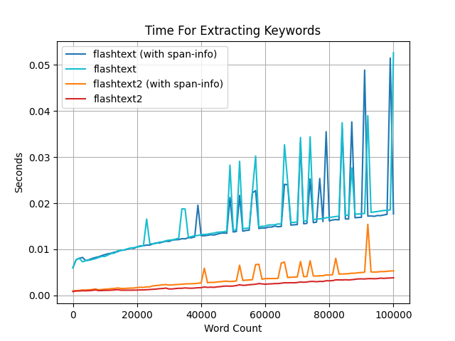

# FlashText 2.0

----
[`flashtext`](https://github.com/vi3k6i5/flashtext)
is great, but wouldn't it be nice if the code was much simpler, so instead of 
[this](https://github.com/vi3k6i5/flashtext/blob/5591859aabe3da37499a20d0d0d6dd77e480ed8d/flashtext/keyword.py#L470-L558):
```py
def extract_keywords(self, sentence, span_info=False):
    keywords_extracted = []
    if not sentence:
        # if sentence is empty or none just return empty list
        return keywords_extracted
    if not self.case_sensitive:
        sentence = sentence.lower()
    current_dict = self.keyword_trie_dict
    sequence_start_pos = 0
    sequence_end_pos = 0
    reset_current_dict = False
    idx = 0
    sentence_len = len(sentence)
    while idx < sentence_len:
        char = sentence[idx]
        # when we reach a character that might denote word end
        if char not in self.non_word_boundaries:

            # if end is present in current_dict
            if self._keyword in current_dict or char in current_dict:
                # update longest sequence found
                sequence_found = None
                longest_sequence_found = None
                is_longer_seq_found = False
                if self._keyword in current_dict:
                    sequence_found = current_dict[self._keyword]
                    longest_sequence_found = current_dict[self._keyword]
                    sequence_end_pos = idx
                    
    # and many more lines ... (89 lines in total)
```
We would have [this](https://github.com/shner-elmo/FlashText2.0/blob/master/flashtext2/keyword_processor.py#L54#L81):
```py
def extract_keywords_iter(self, sentence: str) -> Iterator[tuple[str, int, int]]:
    if not self._case_sensitive:
        sentence = sentence.lower()

    words: list[str] = self.split_sentence(sentence) + ['']
    lst_len: list[int] = list(map(len, words))  # cache the len() of each word
    keyword = self.keyword
    trie = self.trie_dict
    node = trie

    last_kw_found: str | None = None
    last_kw_found_idx: tuple[int, int] | None = None
    last_start_span: tuple[int, int] | None = None
    n_words_covered = 0
    idx = 0
    while idx < len(words):
        word = words[idx]

        n_words_covered += 1
        node = node.get(word)
        if node:
            kw = node.get(keyword)
            if kw:
                last_kw_found = kw
                last_kw_found_idx = (idx, n_words_covered)
        else:
            if last_kw_found is not None:
                kw_end_idx, kw_n_covered = last_kw_found_idx
                start_span_idx = kw_end_idx - kw_n_covered + 1

                if last_start_span is None:
                    start_span = sum(lst_len[:start_span_idx])
                else:
                    start_span = last_start_span[1] + sum(lst_len[last_start_span[0]:start_span_idx])
                last_start_span = start_span_idx, start_span  # cache the len() for the given slice for next time

                yield last_kw_found, start_span, start_span + sum(
                    lst_len[start_span_idx:start_span_idx + kw_n_covered])
                last_kw_found = None
                idx -= 1
            else:
                idx -= n_words_covered - 1
            node = trie
            n_words_covered = 0
        idx += 1
```
Much more readable, right?  
Also, other than rewriting all the functions with simpler, shorter, and more intuitive code,
all the methods and functions are fully typed.

## Performance

Simplicity is great, but how is the performance?

I created some benchmarks which you could find [here](https://github.com/shner-elmo/FlashText2.0/tree/master/benchmarks), 
and it turns out that both for extracting and replacing keywords it is faster than the original package:

Extracting keywords:


Replacing keywords:


---
## Quick Start
Import and initialize the class:
```py
>>> from flashtext2 import KeywordProcessor
>>> kp = KeywordProcessor()
```

Add a bunch of words:
```py
>>> kp.add_keywords_from_dict({'py': 'Python', 'go': 'Golang', 'hello': 'hey'})
```
The dictionary keys represent the words that we want to search in the string, 
and the values are their corresponding 'clean word'.

Check how many words we added:
```py
>>> len(kp)
3
```

We can see how the key/values are stored in the trie dict:
```python
>>> kp.trie_dict
{'py': {'__keyword__': 'Python'},
 'go': {'__keyword__': 'Golang'},
 'hello': {'__keyword__': 'hey'}}
```

One major change in FlashText 2.0 is that the keywords are splitted by words and non-words groups instead of characters.
For example, if you were to add the keyword/sentence `"I love .NET"` it would be stored like this:
```py
kp2 = KeywordProcessor()
kp2.add_keyword("I love .NET")  # not actually :)
>>> kp2.trie_dict
```
```
{'i': {' ': {'love': {' ': {'': {'.': {'net': {'__keyword__': 'I love .NET'}}}}}}}}
```


### Extracting Keywords

```py
from flashtext2 import KeywordProcessor
kp = KeywordProcessor()
kp.add_keywords_from_dict({'py': 'Python', 'go': 'Golang', 'hello': 'Hey'})

my_str = 'Hello, I love learning Py, aka: Python, and I plan to learn about Go as well.'

kp.extract_keywords(my_str)
```
```
['Hey', 'Python', 'Golang']
```


### Replace Keywords


```py
kp.replace_keywords(my_str)
```
```
'Hey, I love learning Python, aka: Python, and I plan to learn about Golang as well.'
```
