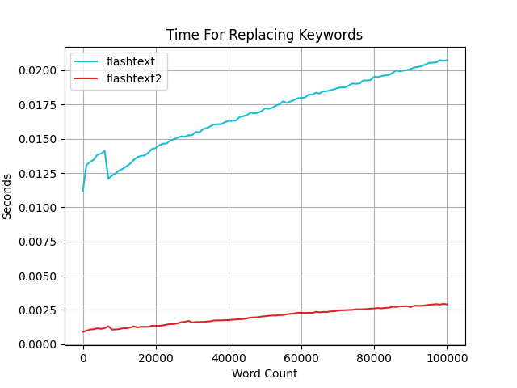

<div align="center">
    
  <a href="https://pypi.org/project/flashtext2"></a>
  <a href="https://pypi.org/project/flashtext2"></a>
  <a href="https://pepy.tech/project/flashtext2"></a>
  <a href="https://pepy.tech/project/flashtext2"></a>
    
</div>

```sh
pip install flashtext2
```

# flashtext2

`flashtext2` is an optimized version of the `flashtext` library for fast keyword extraction and replacement. 
Its orders of magnitude faster compared to regular expressions.

## Key Enhancements in flashtext2

- **Rewritten for Better Performance**: Completely rewritten in Rust, making it approximately 3-10x faster than the original version.
- **Unicode Standard Annex #29**: Instead of relying on arbitrary regex patterns like **flashtext** 
[does](https://github.com/vi3k6i5/flashtext/blob/b316c7e9e54b6b4d078462b302a83db85f884a94/flashtext/keyword.py#L13): `[A-Za-z0-9_]+`, 
**flashtext2** uses the [Unicode Standard Annex #29](https://www.unicode.org/reports/tr29/) to split strings into tokens. 
This ensures compatibility with all languages, not just Latin-based ones.
- **Unicode Case Folding**: Instead of converting strings to lowercase for case-insensitive matches, it uses 
[Unicode case folding](https://www.w3.org/TR/charmod-norm/#definitionCaseFolding), ensuring accurate normalization 
of characters according to the Unicode standard.
- **Fully Type-Hinted API**: The entire API is fully type-hinted, providing better code clarity and improved development experience.


## Usage


<details>
  <summary>Click to unfold usage</summary>

### Keyword Extraction

```python
from flashtext2 import KeywordProcessor

kp = KeywordProcessor(case_sensitive=False)

kp.add_keyword('Python')
kp.add_keyword('flashtext')
kp.add_keyword('program')

text = "I love programming in Python and using the flashtext library."

keywords_found = kp.extract_keywords(text)
print(keywords_found)
# Output: ['Python', 'flashtext']

keywords_found = kp.extract_keywords_with_span(text)
print(keywords_found)
# Output: [('Python', 22, 28), ('flashtext', 43, 52)]
```

### Keyword Replacement

```python
from flashtext2 import KeywordProcessor

kp = KeywordProcessor(case_sensitive=False)

kp.add_keyword('Java', 'Python')
kp.add_keyword('regex', 'flashtext')

text = "I love programming in Java and using the regex library."
new_text = kp.replace_keywords(text)

print(new_text)
# Output: "I love programming in Python and using the flashtext library."
```

### Case Sensitivity

```python
from flashtext2 import KeywordProcessor

text = 'abc aBc ABC'

kp = KeywordProcessor(case_sensitive=True)
kp.add_keyword('aBc')

print(kp.extract_keywords(text))
# Output: ['aBc']

kp = KeywordProcessor(case_sensitive=False)
kp.add_keyword('aBc')

print(kp.extract_keywords(text))
# Output: ['aBc', 'aBc', 'aBc']
```

### Other Examples

Overlapping keywords (returns the longest sequence)
```python
from flashtext2 import KeywordProcessor

kp = KeywordProcessor(case_sensitive=True)
kp.add_keyword('machine')
kp.add_keyword('machine learning')

text = "machine learning is a subset of artificial intelligence"
print(kp.extract_keywords(text))
# Output: ['machine learning']
```

Case folding
```python
from flashtext2 import KeywordProcessor

kp = KeywordProcessor(case_sensitive=False)
kp.add_keywords_from_iter(["flour", "Maße", "ᾲ στο διάολο"])

text = "flour, MASSE, ὰι στο διάολο"
print(kp.extract_keywords(text))
# Output: ['flour', 'Maße', 'ᾲ στο διάολο']
```
</details>


### Performance

<details>
  <summary>
  Click to unfold performance
  </summary>

Extracting keywords is usually 2.5-3x faster, and replacing them is about 10x.  
There is still room to optimize the code and improve performance.   
You can find the benchmarks [here](https://github.com/shner-elmo/FlashText2.0/tree/master/benchmarks).




The words have on average 6 characters, and a sentence has 10k words, so the length is 60k.
</details>


### TODO

<details>
  <summary>
  Click to unfold TODO
  </summary>

* Add multiple ways of normalizing strings: simple case folding, full case folding, and locale-aware folding
* Remove all clones in src code
</details>

Credit to [Vikash Singh](https://github.com/vi3k6i5/), the author of the original `flashtext` package.
